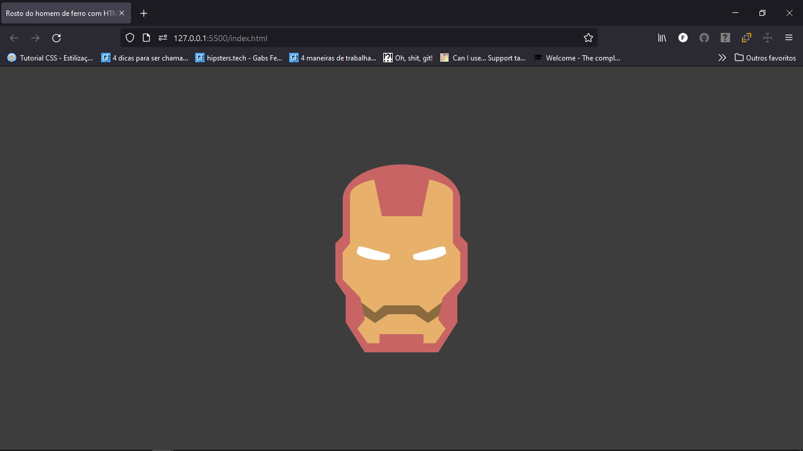

<h1 align="center">Rosto do Homem de ferro</h1>

<h2 align="center">Obrigado pelos conhecimentos Natália Dev: https://www.youtube.com/watch?v=ouvmJvNlMDg</h2>

### Tecnologias usadas

- HTML
- CSS(Me concentrando nas pseudo-classes before e after)

